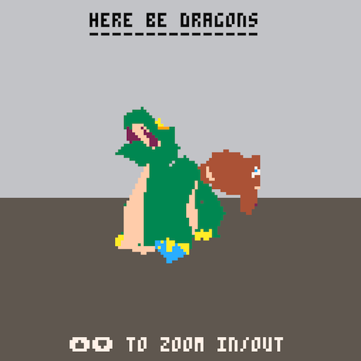

## PICO-8 version

This version is implemented on the PICO-8 virtual console ([official page](https://www.lexaloffle.com/pico-8.php)). It provides a development environment based on LUA, with additional functions to draw to the 128x128 screen. Each program is stored in a 32KB virtual cartridge. 

Both objects geometries were simplified and split into parts containing at most 256 vertices. Positions and face indices are stored on the cartridge (in the sprites memory area). Coordinates are encoded as [0,255] integers (from the [0,1] cube initialy), and indices are stored on one byte. Color indices are stored per-face, using the PICO-8 standard palette.

Transformations and vertex processing are hardcoded as much as possible to save performances. There is no depth buffer, vertices of each object are partially sorted at each frame; as long as the movement is not too fast, the re-ordering is fast enough to avoid most artifacts.

Triangles are rasterized in a scanline fashion: each triangle is split into two triangles sharing an horizontal edge. For each screen line crosed by the triangle , the positions along the triangle edges are computed, and a line is drawn.

